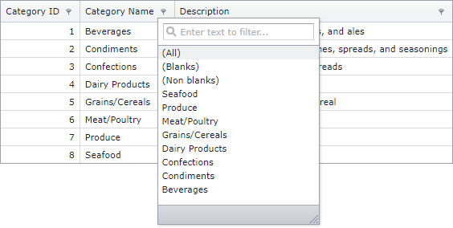

<!-- default badges list -->
[](https://supportcenter.devexpress.com/ticket/details/E4966)
[](https://docs.devexpress.com/GeneralInformation/403183)
<!-- default badges end -->

# Grid View for ASP.NET Web Forms - How to sort header filter items in descending order
<!-- run online -->
**[[Run Online]](https://codecentral.devexpress.com/e4966/)**
<!-- run online end -->

This example demonstrates how to order of items in the header filter. Handle the [HeaderFilterFillItems](https://docs.devexpress.com/AspNet/DevExpress.Web.ASPxGridView.HeaderFilterFillItems) event and use the [e.Values](https://docs.devexpress.com/AspNet/DevExpress.Web.ASPxGridHeaderFilterEventArgs.Values) property to rearrange filter values.



```aspx
protected void ASPxGridView1_HeaderFilterFillItems(object sender, DevExpress.Web.ASPxGridViewHeaderFilterEventArgs e) {
    if (e.Column.FieldName == "CategoryName") {
        var orderedList = e.Values.OrderByDescending(x => x.DisplayText, new MyComparer()).ToList();
        e.Values.Clear();
        e.Values.AddRange(orderedList);
    }        
}
```

## Files to Review

* [Default.aspx](./CS/WebSite/Default.aspx) (VB: [Default.aspx](./VB/WebSite/Default.aspx))
* [Default.aspx.cs](./CS/WebSite/Default.aspx.cs) (VB: [Default.aspx.vb](./VB/WebSite/Default.aspx.vb))
